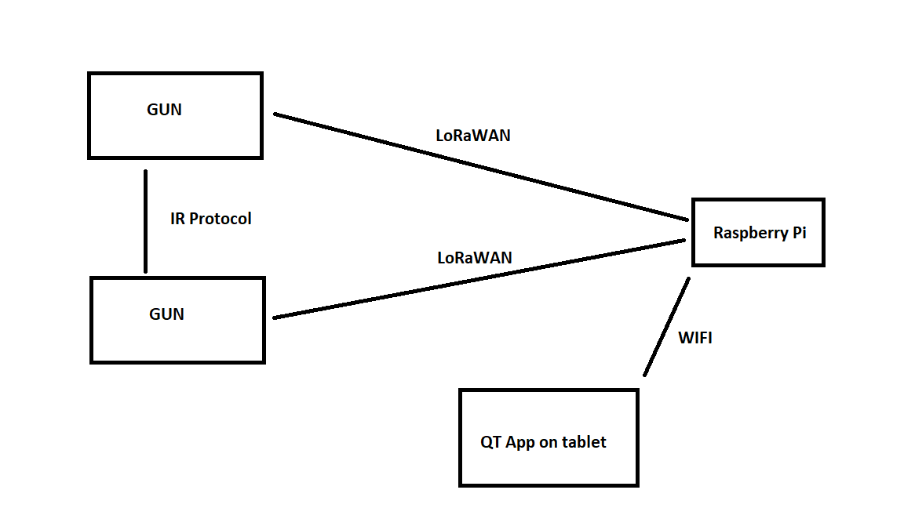
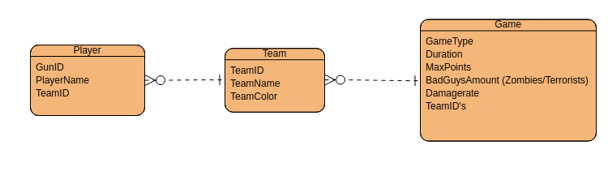

# Lasertag2.0
## Description:
To obtain a high school degree (electricity: electronics), a final project regarding electronics had to be realised. For this, I had decided to build up a simple laser tag system using infrared. This was done using Arduino and self-designed IR sensor PCB's.  6 years later it is time to improve this project! s

## Overall block diagram

## Simple ER Diagram to visualise the info of our classes

